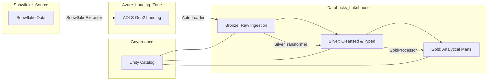

# Snowflake to Azure Databricks Migration Accelerator

[](https://www.python.org/)
[](https://www.databricks.com/)
[](https://azure.microsoft.com/)
[](https://www.terraform.io/)
[](https://spark.apache.org/)
[](https://www.snowflake.com/)

A production-ready data engineering framework designed to accelerate the migration of complex data workloads from Snowflake to the Azure Databricks Lakehouse. This project implements industry-standard best practices including Medallion Architecture, Unity Catalog governance, and Infrastructure as Code.

## 💼 Business Problem

Enterprise organizations migrating from Snowflake to Databricks often face significant hurdles in maintaining data consistency, preserving performance, and ensuring a governed transition. This accelerator provides a reusable blueprint to:
- **Reduce Migration Time**: Standardized extractors and transformation templates.
- **Ensure Data Integrity**: Built-in automated reconciliation between source and target systems.
- **Modernize Governance**: Seamless integration with Unity Catalog for a unified data management layer.
- **Scale Efficiently**: Leveraging Azure ADLS Gen2 and Delta Lake for cost-effective, high-performance storage.

## 🏗️ Architecture

The framework follows a multi-hop **Medallion Architecture** governed by **Unity Catalog**.



## 🛠️ Tech Stack

- **Orchestration**: Python 3.10+, Databricks Workflows
- **Processing**: PySpark, Spark SQL, Delta Lake 3.x
- **Infrastructure**: Terraform
- **Governance**: Unity Catalog
- **Source**: Snowflake (Snowflake Connector for Python)
- **Cloud**: Azure (ADLS Gen2, Key Vault, Databricks)

## 🚀 Getting Started

### Prerequisites

- **Python**: 3.10 or higher.
- **Databricks CLI**: Configured with a valid workspace host and token.
- **Terraform**: v1.5 or higher.
- **Snowflake Account**: With appropriate role and permissions to extract data.

### Environment Setup

1. **Clone the repository**:
   ```bash
   git clone https://github.com/your-repo/snowflake-databricks-migration.git
   cd snowflake-databricks-migration
   ```

2. **Configure Environment Variables**:
   Copy `.env.example` to `.env` and fill in your credentials.
   ```bash
   cp .env.example .env
   ```

3. **Install Dependencies**:
   ```bash
   pip install -r requirements.txt
   ```

### Running the Pipeline

#### 1. Demo Mode (Local)
Run the pipeline using local synthetic data to test structural and logic flows without cloud dependencies.
```bash
export EXECUTION_MODE=demo
python src/main.py
```

#### 2. Production Mode
Ensure Terraform has provisioned the infrastructure and Snowflake connectivity is verified.
```bash
export EXECUTION_MODE=production
python src/main.py
```

### Running Tests

Execute the comprehensive test suite using `pytest`:
```bash
export PYTHONPATH=$PYTHONPATH:.
pytest tests/
```

## 📄 Documentation

- [**Architecture & Design**](docs/architecture.md): Deep dive into the component interactions and layer responsibilities.
- [**Migration Strategy**](docs/migration_strategy.md): Phased approach, reconciliation details, and rollback plans.
- [**Unity Catalog Governance**](docs/unity_catalog.md): Namespace conventions and security models.
- [**Operations Runbook**](docs/operations_runbook.md): Monitoring, maintenance, and failure handling.

## 📝 Change Log
See [CHANGELOG.md](CHANGELOG.md) for a history of updates and releases.
