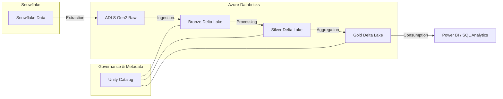

# Architecture Overview

This project implements a robust migration architecture from Snowflake to Databricks on Azure.

## High-Level Architecture

The architecture follows the Medallion (Multi-Hop) pattern, leveraging Databricks Delta Lake and Unity Catalog for governance.

## Components

### 1. Extraction Layer
- **Source**: Snowflake tables.
- **Process**: Python-based extractor using the Snowflake Connector.
- **Destination**: Azure Data Lake Storage (ADLS) Gen2 in Parquet or CSV format.
- **Strategy**: Chunked extraction for large tables, capturing metadata (row counts, timestamps).

### 2. Medallion Architecture
- **Bronze (Raw)**: 1:1 mapping from source. Appends only. Includes `_ingestion_timestamp` and `_source_file`.
- **Silver (Cleansed)**: Conformed data types, renamed columns (snake_case), handling nulls, and deduplication.
- **Gold (Curated)**: Star schema design. Fact and Dimension tables optimized for reporting.

### 3. Data Governance (Unity Catalog)
- Centralized access control.
- Lineage tracking.
- Three-level namespace: `catalog.schema.table`.

### 4. Validation & Reconciliation
- Automated comparison between Snowflake source metrics and Databricks target metrics.
- Focuses on row counts, null counts, and column-level checksums.
