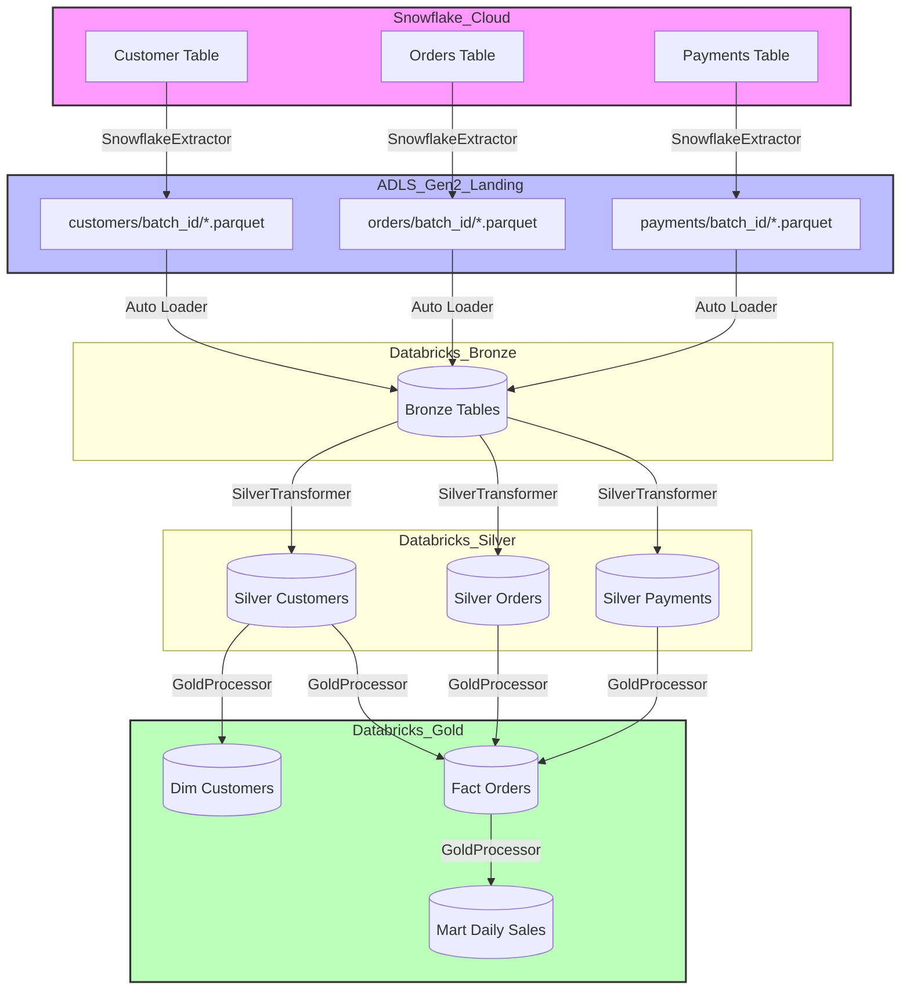

# Architecture & Design Guide

This document provides a detailed technical overview of the Snowflake-to-Azure Databricks Migration Accelerator architecture.

## 1. High-Level System Architecture

The accelerator is built on the Azure cloud platform, leveraging Databricks as the primary compute engine and Delta Lake as the storage format. The goal is to provide a "Lakehouse" architecture that combines the performance and governance of a data warehouse with the flexibility and scale of a data lake.

### 1.1. Core Components

#### 1.1.1. Snowflake (Source System)
The source system where legacy data resides. We treat Snowflake as a structured relational source, interacting with it through the Snowflake Python Connector. We support both full and incremental extraction patterns.

#### 1.1.2. Azure Data Lake Storage Gen2 (ADLS Gen2)
The foundation of the Lakehouse. ADLS Gen2 provides high-performance, hierarchical storage. It is organized into containers representing the different layers of the Medallion Architecture:
- `landing`: Entry point for raw files (Parquet/CSV) extracted from Snowflake.
- `bronze`: Storage for raw ingested Delta tables.
- `silver`: Storage for cleansed and conformed Delta tables.
- `gold`: Storage for curated, business-level Delta tables.

#### 1.1.3. Azure Databricks
The distributed compute engine used for all data processing tasks (ingestion, transformation, validation).
- **Workflows**: Orchestrate the end-to-end pipeline tasks.
- **Compute**: Specialized Job Clusters for high-efficiency processing.
- **Photon**: High-performance vectorization engine for complex transformations.

#### 1.1.4. Unity Catalog (Governance)
Unity Catalog provides centralized access control, auditing, lineage, and data discovery capabilities across the Databricks workspace. It implements a three-level namespace: `catalog.schema.table`.

#### 1.1.5. Terraform (Infrastructure as Code)
All Azure and Databricks resources are provisioned via Terraform modules, ensuring environment parity (Dev, Test, Prod) and reproducible deployments.

## 2. Medallion Architecture (Multi-Hop)

We implement a three-layer Medallion architecture to ensure data quality and maintainability.

### 2.1. Bronze Layer (Raw Ingestion)
- **Responsibility**: Fast, low-impact ingestion from the landing zone.
- **Logic**: 1:1 mapping from source schema.
- **Enrichment**: Addition of technical metadata columns:
  - `_ingestion_timestamp`: When the record hit the Lakehouse.
  - `_source_file`: The origin path in ADLS Gen2.
  - `_batch_id`: A unique identifier for the execution batch.
- **Pattern**: Append-only using Databricks Auto Loader for real-time file detection and schema inference.

### 2.2. Silver Layer (Cleansed & Conformed)
- **Responsibility**: Providing a clean, standardized view of the business entities.
- **Logic**:
  - **Schema Enforcement**: Explicit casting to target data types.
  - **Normalization**: Standardizing column names (snake_case) and string values (trim, upper).
  - **Handling Nulls**: Enforcing nullability constraints or providing default values.
  - **Deduplication**: Using `Window` functions to identify the latest version of a record based on business keys and ingestion timestamps.
- **Pattern**: Idempotent **Delta MERGE** (Upsert) to ensure only modified or new records are updated.

### 2.3. Gold Layer (Curated & Analytical)
- **Responsibility**: Business-ready data optimized for reporting and machine learning.
- **Logic**:
  - **Dimensional Modeling**: Implementation of Star Schemas with Dimensions (SCD Type 1/2) and Fact tables.
  - **Aggregations**: Pre-calculated metrics (e.g., Daily Revenue, CLV).
  - **Performance Optimization**: Application of Liquid Clustering or Z-Ordering on high-cardinality columns.
- **Pattern**: Overwrite or Incremental Merge depending on the size of the mart.

## 3. Data Flow Diagram

## 4. Unity Catalog Governance Model

### 4.1. Namespace Convention
We use a structured namespace to separate environments and concerns:
`migration_<env>.<layer>.<table_name>`

Example: `migration_prod.silver.customers`

### 4.2. Security Roles
- **Data Engineers**: Full access to Bronze, Silver, and Gold.
- **Data Scientists**: Read access to Silver and Gold.
- **Data Analysts**: Read access only to the Gold curated layer.
- **Service Principals**: Used for automated job execution with managed identity credentials.

### 4.3. Data Protection
- **PII Tagging**: Columns containing sensitive data (e.g., email) are tagged in Unity Catalog.
- **Dynamic Masking**: Masking policies are applied based on user group membership to ensure least-privilege access.

## 5. Ingestion Strategy

### 5.1. Watermarking
Incremental ingestion is managed via high-watermark tracking.
- The `SnowflakeExtractor` identifies the maximum value in a configured `incremental_col` (usually `UPDATED_AT` or `CREATED_AT`).
- This value is persisted in the `metadata/` directory.
- Subsequent runs only extract records where the watermark column value is greater than the last recorded value.

### 5.2. Idempotency and Retries
The pipeline is designed to be idempotent.
- Bronze ingestion uses `append` mode with unique batch IDs.
- Silver and Gold layers use `MERGE` or `overwrite` logic, allowing the pipeline to be re-run safely in case of partial failures without corrupting downstream data.

## 6. Performance and Scalability

### 6.1. File Management
- **Compaction**: Automated `OPTIMIZE` commands are run periodically to maintain efficient file sizes (targeting 128MB - 1GB).
- **Vacuuming**: Old file versions and deleted data are removed after the retention period (default 7 days) to manage storage costs.

### 6.2. Compute Strategy
- **Serverless SQL**: For ad-hoc queries and analytical exploration.
- **Job Clusters**: For all scheduled ETL tasks to leverage lower unit costs and optimized spin-up times.
- **Caching**: Local SSD caching on DS-series VMs is utilized for Silver-to-Gold joins.
